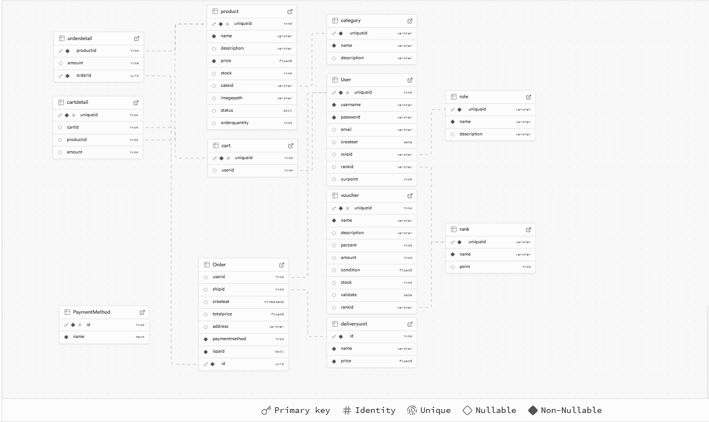
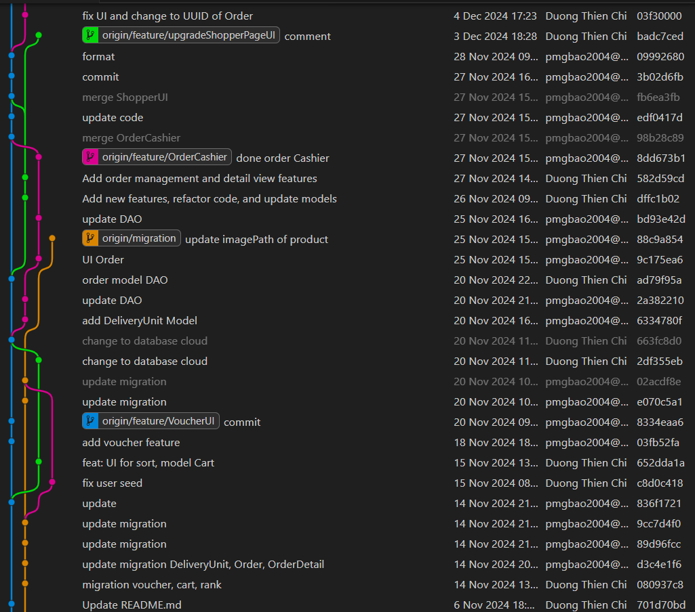
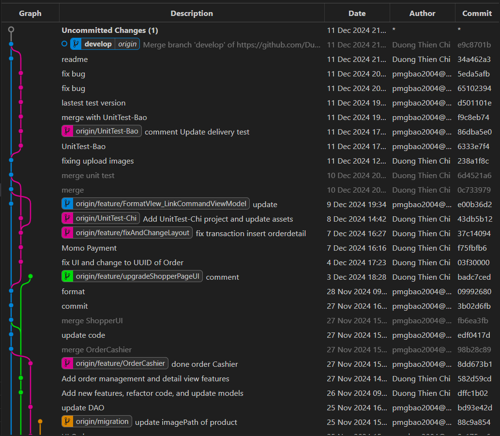

# Lập trình Windows - Đồ án hệ thống mua bán hàng cho cửa hàng nhỏ.

## Nhóm

- 22120026 - Phan Minh Gia Bảo
- 22120035 - Dương Thiện Chí

## Chi tiết milestone 01:

### Các chức năng đã hoàn thành:

- Tài khoản:
  - admin - 1234
  - manager - 1234
  - shopper - 1234
- Trang xem sản phẩm của người mua hàng (shopper)
  - Hiển thị danh sách sản phẩm
  - Tìm kiếm sản phẩm theo tên (dùng AutoSuggestionBox để hiển thị danh sách đề xuất)
  - Lọc sản phẩm theo loại hàng
- Trang hiển thị giỏ hàng (shopper)
  - Thêm xóa sản phẩm trong giỏ hàng
  - Tự động cập nhật khoản tiền thanh toán
- Trang dashboard của cửa hàng và admin (2 trang)
  - Thêm xóa sửa sản phẩm và cập nhật lên database.
  - Hiển thị các sản phẩm dựa theo category.
  - Thêm category và cập nhật lên database.
- Trang quản lý các tài khoản (admin)
  - Thêm xóa sửa các tài khoản và cập nhật lên database.
  - Trang đăng nhập/quên mật khẩu/ đăng ký (3 trang)
- Đăng nhập: dùng Bcrypt để mã hóa mật khẩu và xác thực mật khẩu, có sử dụng checkbox remember me để lưu trữ tài khoản trước đó
- Đăng ký: tạo tài khoản mới và lưu vào database, mật khẩu mã hóa bằng Bcrypt

### Database:

#### Thiết kế:


- Ảnh trên là database cơ bản phục vụ cho các chức năng ở milestone 01 này, sau này sẽ mở rộng thêm.

### UI/UX Design:

#### Về giao diện:

- Nhóm chúng em sử dụng template figma: https://www.figma.com/design/g4XuE4b5jkY7ayEogwApLc/POS-System-Web-UI-(Community)
- Chúng em lấy ý tưởng dựa trên thiết kế trên và có chỉnh sửa lại cho phù hợp với chủ đề của đồ án

#### Về xử lí lỗi và responsive:

- Giao diện hiện tại có bắt các lỗi nhập thiếu dữ liệu.
- Giao diện hỗ trợ tốt cho fullscreen laptop [1920x1080]

### Design Patterns - Architecture

#### Factory Design Pattern:

- Chúng em dùng Factory Design Pattern để khởi tạo đối tượng các lớp DAO và BUS hỗ trợ cho mô hình Three Layers. Điều này giúp việc thay đổi luồng dữ liệu đầu vào một cách nhanh chóng, giúp quá trình test cũng như mở rộng hệ thống dễ dàng hơn.

#### Architecture:

- Sử dụng Three Layers Architecture để tách biệt phần xử lí GUI, Logic và Data; giúp hệ thống dễ bảo trì, mở rộng, tách biệt code giúp quá trình làm việc tường minh hơn.
- Nhóm chúng em dùng MVVM cho phần GUI giúp tách biệt phần xử lí dữ liệu và hiển thị dữ liệu ra riêng biệt, hỗ trợ việc kiểm tra unit test vì phần xử lí đã tách riêng ra phần hiển thị dữ liệu (View), và dễ dàng chỉnh sửa lại giao diện nếu có thay đổi

#### Tổng kết:

Việc sử dụng kết hợp giữa Factory Design Pattern, Three Layers và MVVM giúp mã nguồn của dự án tường minh hơn, một mã nguồn tách biệt từng phần sẽ dễ dàng test và sửa lỗi cũng như dễ mở rộng. Tuy nhiên, nhóm vẫn chưa hoàn thiện được mô hình MVVM ở milestone 01 này, kiến trúc hệ thống vẫn chưa hoàn thiện và ứng dụng được hết ý nghĩa của các kĩ thuật/kiến trúc trên.

### Advanceed Topics:

- Sử dụng AutoSuggestionBox để hỗ trợ tìm kiếm sản phẩm, khi người dùng nhập chữ sẽ tự động đề xuất và hiển thị danh sách.
- Sử dụng lớp ICommand để có thể binding command từ View sang ViewModel.
- Dùng Extension Configuration và Configuration.Json để đọc file appsettings.json.
- Dùng UserControl để tạo dialog trên Page
- Dùng Bcrypt để mã hóa mật khẩu
- Dùng Invoke trong UserControll để tới dữ liệu qua Page

### Teamwork - Git flow:

#### Meeting:

- Trong quá trình làm việc nhóm sẽ trao đổi thông tin, báo cáo tiến độ qua nhóm chat.
- Chi tiết biên bản họp nhóm ở link sau:

* Lần 1: https://docs.google.com/document/d/1jukkav0Mdove9GiL-h8xHUe2Gqvqrya3gDNOAjmQETE/edit?usp=sharing
* Lần 2: https://docs.google.com/document/d/15kw1f-y4ToJVGdCeA8kOGc6K1QZZOYwOT-CVQdTNzbE/edit?usp=sharing

#### Git flow:

- Tổ chức và làm việc với repo bằng mô hình Git Flow đơn giản: nhánh master là nhánh chính, develop là nhánh trong quá trình phát triển và các nhánh feature tạo từ develop để code các chức năng khác nhau.
- Khi một tính năng được hoàn thành và kiểm tra lỗi sẽ đươc gộp nhánh develop.
- Với milestone 01 này sẽ là version 01 của dự án khi này nhánh develop sẽ gộp vào main để ra mắt phiên bản đầu tiên.
- Nếu ứng dụng sau khi ra mắt có lỗi sẽ tạo 1 nhánh hotfix từ master để sửa lỗi.
- Vì đây là dự án nhỏ và với team size là 2 người nên chúng em tinh gọn lại bỏ đi nhánh release.

### Quality Assurance

- Các chức năng sẽ được thành viên thực hiện test thủ công rồi báo cáo cho nhóm để đưa vào nhánh chính.
- Sau khi đưa vào nhánh chính nếu có xung đột với chức năng khác thì sẽ được chỉnh sửa rồi gộp lại
- Các điều trên được thể hiện qua git graph:


## Chi tiết milestone 02:

### Các chức năng đã hoàn thành:

Ngoài các chức năng đã hoàn thành ở milestone 01, thì nhóm đã có hoàn thành thêm các chức năng sau:

- Mở rộng database để quản lý đơn vị giao hàng, đơn hàng, khuyến mãi, giỏ hàng, phương thức thanh toán, Rank (xếp hạng tài khoản khách hàng).
- Cập nhật UI của người dùng trang đặt hàng để chọn được đơn vị giao hàng, khuyến mãi,phương thức thanh toán nhập địa chỉ và hiển thị giá.
- Quản lý voucher khuyến mãi cho admin và manager.
- Tạo đơn hàng dành cho Cashier (đối với khách hàng mua offline).
- Hiển thị danh sách, xem chi tiết Orders dành cho admin và manager.
- Bổ sung thanh toán bằng QR MOMO.
- Bổ sung OrderID bằng UUID.
- Bổ sung upload ảnh từ máy lên cloud.
- Bổ sung trigger ở database để tự động nâng cấp rank của khách hàng khi đủ điểm.
- Cấu trúc lại chương trình xóa bỏ các view bị trùng chức năng.

**Tổng quát**: Nhóm đã thực hiện được theo như proposal

- Đặt hàng và quản lý đặt hàng
- Chương trình khuyến mãi
- Thanh toán
- Mã hóa đơn bằng UUID
- Các tính năng bổ sung, hỗ trợ.

### Database:

#### Ở milestone 02, nhóm đã chuyển từ dùng database local thành dùng cloud của supabase.



#### Supabase hỗ trợ tốt trong migration cũng như cộng tác giữa các thành viên.

### UI/UX:

- Do milestone 01 nhóm còn thiếu sót nên đã có cập nhật và cải thiện thêm. Chi tiết sẽ thể hiện ở Demo.

#### Về UI:

- Nhóm vẫn giữ nguyên khuôn mẫu của milestone 01 nhưng đã có cập nhật một số view và tương tác khác.

#### Về UX:

- Nhóm có cải thiện UX bằng một số animation cơ bản, bắt lỗi cho các trường hợp người dùng tương tác đã đầy đủ hơn.
- Giao diện hỗ trợ tốt cho fullscreen laptop [1920x1080]

### Design Patterns - Architecture

- Nhóm vẫn giữ nguyên như milestone 01 nhưng đã có thêm vài DI cho các service cho việc navigation và paymentService

#### Factory Design Pattern:

- Chúng em dùng Factory Design Pattern để khởi tạo đối tượng các lớp DAO và BUS hỗ trợ cho mô hình Three Layers. Điều này giúp việc thay đổi luồng dữ liệu đầu vào một cách nhanh chóng, giúp quá trình test cũng như mở rộng hệ thống dễ dàng hơn.

#### Architecture:

- Sử dụng Three Layers Architecture để tách biệt phần xử lí GUI, Logic và Data; giúp hệ thống dễ bảo trì, mở rộng, tách biệt code giúp quá trình làm việc tường minh hơn.
- Nhóm chúng em dùng MVVM cho phần GUI giúp tách biệt phần xử lí dữ liệu và hiển thị dữ liệu ra riêng biệt, hỗ trợ việc kiểm tra unit test vì phần xử lí đã tách riêng ra phần hiển thị dữ liệu (View), và dễ dàng chỉnh sửa lại giao diện nếu có thay đổi.

### Advanceed Topics:

Ngoài các Advenced Topics ở milestone 01 thì nhóm đã có bổ sung thêm:

- Thanh toán thông qua Momo bằng Momo API ở môi trường test [Document MomoAPI](https://developers.momo.vn/v3/docs/payment/guides/home) và tham khảo từ kênh [Youtube](https://www.youtube.com/@hieutancodeproject)
- Dùng NagivationService để có thể chuyển frame từ ViewModel.
- Dùng thư viện hỗ trợ của supabase để upload ảnh lên Storage.

### Teamwork - Git flow:

Phân công công việc sẽ nằm trong phần biên bản họp nhóm của từng buổi Meeting.

#### Meeting:

- Trong quá trình làm việc nhóm sẽ trao đổi thông tin, báo cáo tiến độ qua nhóm chat.
- Chi tiết biên bản họp nhóm ở link sau:

* Lần 3: https://docs.google.com/document/d/1DIFWppGFLUr29eYNqDLA6I9aNWPjPiI5QEyDqrR2mQc/edit?usp=sharing
* Lần 4: https://docs.google.com/document/d/1JMT2xk-5ZQwdpWXM_bOaItpwmWyAulEXE25WnHM7HD4/edit?usp=sharing
* Lần 5: https://docs.google.com/document/d/1SKZsRAvlXjmwk0xLN0y30C23pjqZXweAZr3pjmKK5E4/edit?usp=sharing

#### Git flow:

- Tổ chức Git Flow vẫn như milestone 01.

### Quality Assurance

- Nhóm ở milestone này đã bổ sung thêm unit test cho một số hàm. Kết hợp với test thủ công thì với mỗi chức năng thành công sẽ chạy lại unit test và test thủ công.
- Chỉ có một người trong nhóm được tạo pull request, với mỗi pull create được tạo sẽ cần sự cộng tác giữa các thành viên để hỗ trợ sửa conflict cũng như test lại chương trình.
- Các điều trên được thể hiện qua git graph:





## Set up:

- Tạo file appsettings.json trong thư mục BC_Market:
- Cần để appsettings.json là Copy If Newer nếu chương trình không đọc được dữ liệu.

```bash
{
  "ConnectionStrings": {
    "DefaultConnection": "Host=aws-0-ap-southeast-1.pooler.supabase.com;Port=5432;Database=postgres;Username=postgres.xlxwqmipwlkgvqfbihhi;Password=Postgres@123;SslMode=Require;Trust Server Certificate=true"
  },
  "MomoAPI": {
    "MomoApiUrl": "https://test-payment.momo.vn/gw_payment/transactionProcessor",
    "SecretKey": "K951B6PE1waDMi640xX08PD3vg6EkVlz",
    "AccessKey": "F8BBA842ECF85",
    "ReturnUrl": "http://localhost/dummy",
    "NotifyUrl": "http://localhost/dummy",
    "PartnerCode": "MOMO",
    "RequestType": "captureMoMoWallet"
  }
}
```

#### Demo link: https://www.youtube.com/watch?v=Rk-GIqta89Q
